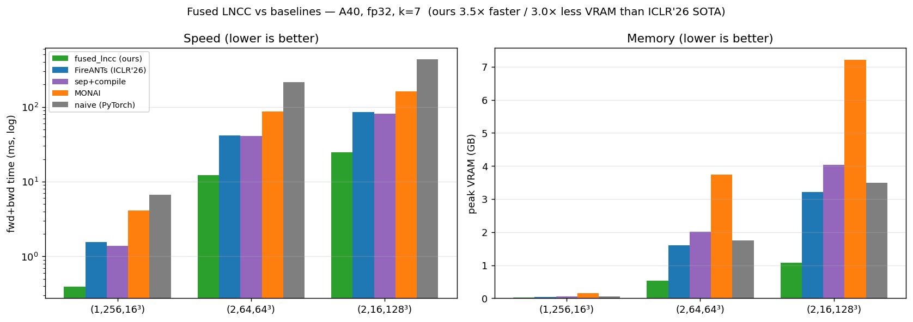
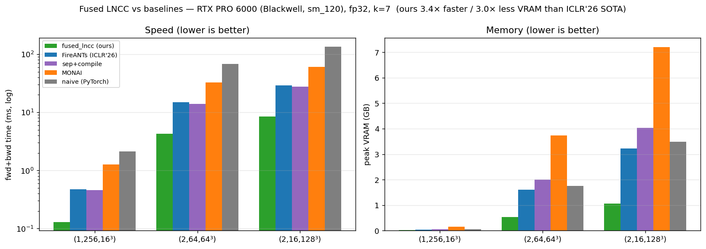

# Benchmarks & details

Full results, the four-GPU comparison, the memory/OOM envelope, end-to-end registration, the GPU
matrix, and the semantics/correctness contract for [fused_lncc](README.md). All numbers are CUDA-event
timed, **median over 40 iterations on paired (identical) inputs** across every contender, with warmup
(covers `torch.compile` and GPU clock ramp); run-to-run CV < 1%. Reproduce with `python bench.py`.

Baselines: **FireANTs** = `fireants_fused_ops` (the FFDP fused kernels, ICLR'26 Oral, built on the
FireANTs registration library; cuDNN convs plus fused elementwise/backward); **sep+compile** = a
separable box-sum plus `torch.compile` reference; **MONAI**
= `LocalNormalizedCrossCorrelationLoss`; **naive** = five dense `conv3d`s plus autograd.

## Benchmark (A40, fp32, k=7, forward + backward)

| shape (N,C,D,H,W) | **fused_lncc** | FireANTs (FFDP) | sep + `torch.compile` | MONAI | naive (PyTorch) |
|---|---|---|---|---|---|
| (1,256,16³) | **0.39 ms / 0.02 GB** | 1.56 / 0.04 | 1.38 / 0.06 | 4.14 / 0.15 | 6.66 / 0.06 |
| (2,64,64³)  | **12.2 ms / 0.54 GB** | 41.7 / 1.61 | 40.6 / 2.01 | 86.1 / 3.74 | 215.4 / 1.75 |
| (2,16,128³) | **24.5 ms / 1.07 GB** | 85.7 / 3.22 | 81.1 / 4.03 | 162.5 / 7.21 | 432.5 / 3.49 |

About **3.4-4.0x faster / 3.0x less memory** vs FireANTs, **3.3x / 3.8x** vs separable+compile,
**6.6-10.5x** vs MONAI, **~18x** vs naive (`time / peak-VRAM`).

All contenders run the regime fused_lncc supports: rectangular box, gradient to `pred` only, exact
backward. FireANTs is run in the matching mode: only `pred` requires grad (its lean 3C-channel
backward path) and with its exact gradient, not the `use_ants_gradient` approximation, so this is
apples-to-apples *within that scope*. See [the scope comparison](README.md#scope-vs-ffdpfireants) for
what FFDP does that fused_lncc does not (Gaussian, large kernels, dual-image gradients, gigavoxel
sharding).



Speed and peak memory for the forward + backward step across volume sizes:


## Reproduced across four GPUs (sm_70 to sm_120)

The **same wheel** was run on a V100, an A100 (MIG slice), and a Blackwell RTX PRO 6000, spanning Volta,
Ampere, and Blackwell. Headline is the fwd+bwd `(2,16,128³)` case (`time / peak-VRAM`, fp32, k=7):

| GPU (arch) | **fused_lncc** | vs FireANTs | vs MONAI | vs naive | registration vs MONAI |
|---|---|---|---|---|---|
| **A40** (sm_86) | **24.5 ms / 1.07 GB** | 3.5x / 3.0x | 6.6x | 18x | 3.0x |
| **V100** (sm_70) | **27.6 ms / 1.07 GB** | 3.4x / 3.0x | 5.8x | 18x | 4.0x |
| **A100 80GB** (sm_80, MIG 3g.40gb) | **32.5 ms / 1.07 GB** | 4.7x / 3.0x | 7.5x | 28x | 4.8x |
| **RTX PRO 6000** (sm_120, Blackwell) | **8.5 ms / 1.07 GB** | 3.4x / 3.0x | 7.2x | 16x | 2.8x |

All four **vs-FireANTs** numbers are direct head-to-heads (FireANTs rebuilt from source for each arch).
The ratio is stable, **3.4-3.5x on full GPUs**, and **wider (4.7x) on the constrained A100 MIG slice**:
a 3g.40gb instance has only ~3/7 of the A100's SMs and bandwidth, which penalizes the baselines' heavier
memory and compute footprint more than our lean kernel (so the absolute time is slower than a full card,
but the ratio grows). Same story, amplified under resource pressure.

- **V100 (sm_70):** the A40-built wheel loaded and ran with **no rebuild** (embedded sm_70 SASS); only
  ~13% slower than the A40 despite lower fp32 throughput, since it is memory-bound and rides the HBM2.
- **A100 80GB (sm_80), MIG 3g.40gb slice:** native sm_80 SASS runs directly; **first MIG run**, and
  compute-sanitizer works under MIG (unlike `ncu`, whose perf counters are disabled on MIG).
- **RTX PRO 6000 (sm_120, Blackwell):** first proof of the **PTX forward-compat path**. The wheel's
  `compute_90` PTX **JIT-compiled to sm_120 at load with no rebuild**; native sm_120 SASS was then added
  to the default arch list. About 2.9x faster than the A40 in absolute terms.
- **bf16 is ~1.05x** on V100/A100/Blackwell: it only halves the p/t input traffic (the adjoint outputs
  stay fp32 for the precise backward), so it is a storage/compat feature, not a speed lever.

<sub>FireANTs' prebuilt op ships sm_86-only, so I rebuilt it from source (`TORCH_CUDA_ARCH_LIST=7.0;8.0;8.6;12.0`)
to get a direct head-to-head on each GPU rather than a cuDNN-conv proxy.</sub>

Blackwell, with the rebuilt FireANTs (same `bench.py`, two runs agreed to <1%):



## Memory scaling and the OOM envelope

The speed multiple is **flat with volume size** (~3.5x vs FireANTs at every size from 128³ to 256³),
expected for a memory-bound kernel: bigger inputs buy headroom, not a bigger ratio. Where larger volumes
separate us is **memory**, because we never materialize the box-sum intermediates or an autograd tape.
**Total** peak VRAM (the whole footprint that must fit; fwd+bwd, k=7):

| shape (N,C,D,H,W) | voxels | **fused_lncc** | FireANTs | MONAI | naive |
|---|---|---|---|---|---|
| (2,16,128³) | 67 M  | **1.6 GB**  | 3.8  | 7.8  | 4.0 |
| (2,16,192³) | 226 M | **5.4 GB**  | 12.7 | 25.9 | 13.6 |
| (2,16,256³) | 537 M | **12.9 GB** | 30.1 | 61.1 | 32.2 |

This footprint is **shape-determined, not GPU-specific**, so it maps onto each GPU's capacity:

- On a **24 GB** GPU (RTX 4090, A5000) at 256³, **fused_lncc runs in 12.9 GB while FireANTs (30 GB),
  MONAI (61 GB), and naive (32 GB) all run out of memory.**
- On a **16 GB V100**, the gap opens sooner: MONAI already exceeds memory by ~192³.
- On a **48 GB A40**, MONAI OOMs at 256³; the others survive.

The practical payoff of the fusion is not a flashier speed number at high resolution. It is that you can
**train/register at resolutions and batch sizes the baselines cannot fit at all.**

## End-to-end: image registration

The microbenchmarks time the loss in isolation. The real use case is gradient-based dense 3D
registration, where LNCC is the optimized objective. The **same** registration (96³ volume, 150 Adam
iters, `LNCC + diffusion` regularizer, [`examples/registration_demo.py`](examples/registration_demo.py)):

| | ms / iter | peak VRAM | final LNCC sim | final MSE |
|---|---|---|---|---|
| **fused_lncc (ours)** | **3.1** | **0.16 GB** | 0.996 | 6.3e-4 |
| MONAI | 9.3 | 0.21 GB | 0.996 | 6.3e-4 |

**Identical registration quality** (both drive similarity 0.44 to 0.996), but **3.0x faster per
iteration** (0.46 s vs 1.39 s total). Against MONAI the kernel speedup mostly carries through, because
the loss dominates each iteration; against an already-fused baseline like FFDP it does not (see below).
(Per-GPU registration speedups are in the four-GPU table above.)

**vs FFDP, end-to-end.** With FFDP's fused loss already in FireANTs, swapping in fused_lncc gives
**~1.1-1.15x** per iteration (vs FFDP's default ANTs-approximate gradient, and slightly more accurate,
since fused_lncc uses the exact gradient) or **~1.3-1.4x** with a matched exact gradient, at equal VRAM
and equal registration quality (128³-256³, A40, full FireANTs `GreedyRegistration`). The loss-only
~3.4x does **not** carry through here: once the loss is fused it is only ~38% of an iteration (the rest
is `grid_sample` + displacement-field smoothing + Adam), so even an infinitely fast loss could speed the
whole step up by at most ~1.6x. The large end-to-end win above is against the **non-fused** MONAI LNCC,
where the loss dominates the step.

## GPU support

Verified on four GPUs (V100/A100/A40/Blackwell); for the rest I separate what *should work* from what
I have actually run. The same multi-arch wheel runs on V100/A100 with no rebuild, and its `compute_90`
PTX JIT-compiled to Blackwell at load, so both the SASS and PTX forward-compat paths are proven.

**Toolchain matrix:** the source builds and passes the full `pytest` suite (13/13) on **PyTorch 2.3 to
2.12** and **CUDA 11.8 to 13.x** (spot-checked on torch 2.1.2/CUDA 11.8, 2.6/CUDA 12.6, 2.10/CUDA 12.8,
and 2.12.1/CUDA 13.0, all on an A40). torch 2.1.x also works but is below the declared `torch>=2.3`
floor and needs `--no-deps` plus `setuptools<70` at build time, so 2.3 is the supported minimum.

**CUDA 13 note:** CUDA 13's `nvcc` dropped `sm_70` (Volta), so `setup.py` only includes `7.0` in the
default arch list when building with CUDA < 13 (otherwise the build would fail with "Unsupported gpu
architecture 'compute_70'"). `sm_75` (Turing) and everything newer are kept. Practically: a **V100
(Volta) needs a CUDA 12.x or older toolkit**; the kernel itself compiles cleanly under CUDA 13.

| | status |
|---|---|
| **A40 (sm_86)** | Verified. Full correctness, compute-sanitizer, and benchmark suite. |
| **V100 (sm_70)** | Verified. Same wheel, no rebuild. All suites plus `pytest`, sanitizer clean fp32+bf16, k=3..9 (k=9 = 92 KB fits the 96 KB cap), full benchmark plus registration. bf16 works despite Volta having no bf16 ALUs (load-time conversion only). |
| **A100 80GB (sm_80)** | Verified on a **MIG 3g.40gb** slice. Native sm_80 SASS, all suites plus `pytest` plus compute-sanitizer clean (fp32+bf16), k=3..9, full benchmark plus registration. First MIG run; the relative speedup widens on the partitioned slice. |
| **RTX PRO 6000 (sm_120, Blackwell)** | Verified. Full suites plus sanitizer (fp32+bf16), k=3..9, benchmark plus registration. The A40-built wheel's `compute_90` **PTX JIT-compiled to sm_120 at load with no rebuild**; native sm_120 SASS then added to the default arch list. |
| **A6000/RTX 30xx (sm_86), L40/RTX 40xx (sm_89), H100 (sm_90)** | Should work, untested. Native SASS for each is in the wheel (`cuobjdump --list-elf` confirms sm_70/75/80/86/89/90/120); standard CUDA, no arch-specific tricks; shared-mem caps (>=96 KB) fit every `kernel_size`. With sm_70/80/86/120 all verified, these are low-risk, but I have not run them. |
| **Turing, T4 / RTX 20xx (sm_75)** | `kernel_size <= 5` only, untested. The fused forward needs ~70 KB (k=7) / ~92 KB (k=9) of shared memory; Turing's opt-in cap is 64 KB. `k <= 5` (<=51 KB) fits; `k >= 7` raises a clear runtime error (not a crash). |
| **GPUs newer than sm_120** | Should JIT, untested. The wheel embeds `compute_120` PTX; the driver JIT-compiles it at load (the forward-compat path verified sm_90-PTX to sm_120). |
| **Non-NVIDIA (Apple, AMD, ...)** | Not supported. This is a CUDA extension and needs an NVIDIA GPU. |

## Correctness

The forward ncc map and the analytic backward match a pure-PyTorch reference and MONAI's rectangular
LNCC to **~1e-7** (forward) and **cosine = 1.000000, rel ~1e-7** (gradient), across `k` in {3,5,7,9},
non-cube shapes, and batch/channel sweeps. The fused backward is locked against the box-sum scatter
formula by a regression test (~1e-12). Degenerate inputs (all-zero, constant, 1e4-magnitude, tiny
`D<k`) stay finite and in `[0,1]`; NaN/Inf inputs propagate to a visible `NaN` loss (not silently
masked). compute-sanitizer (memcheck/racecheck) is clean on every verified GPU. See `tests/`
(`pytest tests/test_pytest.py`).

## Semantics

Squared local Pearson correlation, MONAI-compatible:

```
cross = Spt - Sp*St/n ;  var = max(Sxx - Sx^2/n, 0) + smooth_dr ;  n = k^3
ncc   = cross^2 / (var_p * var_t)  clamped to [0,1]
loss  = 1 - mean(ncc)      # similarity in [0,1]; lower loss = better local correlation
```

Gradient flows through `pred` only (`target` is the reference). fp32 or bf16 (bf16 reads/writes in
bf16, accumulates in fp32), 3D, odd `kernel_size` in {3,5,7,9}.

## Known limitations and roadmap

- **fp32 / bf16, 3D, odd `kernel_size` in {3,5,7,9} only.** Everything else raises a clean error.
- **Turing (sm_75)** is limited to `k <= 5` by its 64 KB shared-memory cap (clean error for `k >= 7`).
- An `ncu` profile showed the kernel is **latency-bound by ~33% occupancy** (the ~70 KB shared
  footprint allows 1 block/SM), not DRAM- or compute-bound, so `float4` loads and a running-sum box
  target non-bottlenecks and were ruled out; the occupancy lever was already taken by the tile sweep.
- Open: a smaller-tile fallback for Turing `k >= 7`; fp16; 2D and general N-D; non-cubic windows;
  `reduction='none'/'sum'`.
