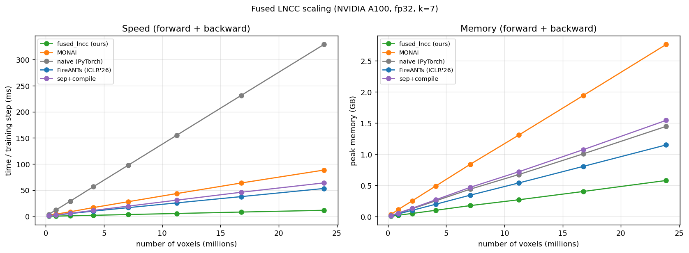

# Fused LNCC

A **fully-fused CUDA** kernel for the 3D **Local (squared) Normalized Cross-Correlation** loss, the
similarity metric used in deformable image registration and as a perceptual/structural loss.

It is **~3.5x faster and ~3x lighter on memory** than the previous fastest differentiable 3D LNCC
(FFDP, ICLR'26 Oral, the fused-kernel framework built on the FireANTs registration library),
~6-10x faster than MONAI, and ~16-18x faster than naive PyTorch, while
producing matching gradients. These are loss-kernel numbers; the end-to-end registration
speedup is smaller (see below). Verified on V100, A100, A40, and Blackwell.

## Install

Requires an NVIDIA GPU, a CUDA toolchain (`nvcc`, `gcc`), and **PyTorch already installed with a CUDA
build matching your `nvcc`**. From PyPI:

```bash
pip install fused_lncc --no-build-isolation
```

Or from source:

```bash
pip install -e . --no-build-isolation
```

`--no-build-isolation` is required: it builds the CUDA extension against your existing PyTorch. Without
it, pip's isolated build pulls its own (often newer-CUDA) PyTorch that mismatches your `nvcc` and the
build fails. Either way it compiles the kernel for every supported arch, so **expect it to take a few
minutes**.

The wheel ships SASS for sm_70..90 plus sm_120 and JIT-compiles from PTX on newer GPUs, so it should
run out of the box from Volta through Blackwell (V100/A100/A40/Blackwell are verified; see
[GPU support](#gpu-support)). Turing (sm_75) runs but its 64 KB shared memory limits it to k≤5.
(CUDA only; no Apple/Metal or AMD/ROCm backend.)

Tested with **PyTorch 2.3 to 2.12** and **CUDA 11.8 to 13.x** (it is a source build, so it compiles
against your own torch + CUDA). One caveat: CUDA 13 dropped Volta, so a V100 needs a CUDA 12.x or
older toolkit (the build selects arches automatically).

## Usage

```python
from fused_lncc import fused_lncc_loss

loss = fused_lncc_loss(pred, target, kernel_size=7)   # pred, target: (N,C,D,H,W) CUDA -> scalar in [0,1]
loss.backward()                                        # gradient flows through `pred`
```

It is a standard `torch.autograd.Function`, so it drops into any training loop and composes with other
loss terms:

```python
for x, target in loader:
    opt.zero_grad()
    pred = model(x)
    loss = F.l1_loss(pred, target) + 0.5 * fused_lncc_loss(pred, target, kernel_size=7)
    loss.backward()
    opt.step()
```

`fp32` or `bf16`, odd `kernel_size` in {3,5,7,9}. Returns `1 - mean(local correlation)` (lower is
better). Forward values match MONAI's rectangular LNCC and a PyTorch reference to ~1e-7, and the
analytic gradient matches to cosine >0.9999 (relative error <1e-3).

Notes: the gradient flows through `pred` only (`target` is treated as a fixed reference). Inputs must
be `fp32` or `bf16`, not `fp16`, so under `torch.autocast(dtype=float16)` cast first, e.g.
`fused_lncc_loss(pred.float(), target.float(), 7)` (bf16 autocast works directly).

## Use in FireANTs

fused_lncc can also serve as an optional LNCC backend in [FireANTs](https://github.com/rohitrango/fireants)
registration: install it, then pass `loss_type='fused_lncc'` (rectangular kernel, pred-only gradient,
single GPU; falls back to the built-in `cc` loss if not installed).

## Performance

Speed and peak memory for the forward + backward step as the volume grows, against the common
alternatives:



Headline at `(2,16,128³)`, A40, fp32, k=7, **forward + backward** (`time / peak-VRAM`, lower is better):

| | **fused_lncc** | FFDP (ICLR'26) | MONAI | sep + compile | naive (PyTorch) |
|---|---|---|---|---|---|
| time / peak-VRAM (ms / GB) | **24.5 / 1.07** | 85.7 / 3.22 | 162.5 / 7.21 | 81.1 / 4.03 | 432.5 / 3.49 |
| **vs fused_lncc** (slower / VRAM) | 1x / 1x | 3.5x / 3.0x | 6.6x / 6.7x | 3.3x / 3.8x | 18x / 3.3x |

**3.5x faster and 3x less memory than the SOTA**, and the gap holds across V100/A100/A40/Blackwell. At
high resolution the memory advantage becomes an OOM boundary: at 256³, fused_lncc runs in ~13 GB while
the baselines need 30-61 GB and run out of memory on a 24 GB card.

**What the benchmark measures.** All contenders run the regime fused_lncc supports: rectangular box,
gradient to `pred` only, and the **exact** backward. FFDP is run in the matching mode: only `pred`
requires grad, so it takes its lean 3C-channel backward path, and with its exact gradient (not the
cheaper `use_ants_gradient` approximation). It is apples-to-apples *within that scope*: not a claim
over everything FFDP can do (Gaussian, large kernels, dual-image gradients, gigavoxel sharding).

**End-to-end note.** The numbers above are for the loss kernel in isolation. In a full registration
pipeline the speedup depends on how much of each step the loss actually is: against the non-fused MONAI
LNCC it stays large (~3x per iteration, since the loss dominates the step), but against FFDP (which
already fuses the loss) it is modest (**~1.1-1.15x**, or ~1.3-1.4x with a matched exact gradient), at
equal memory and equal registration quality, because the fused loss is only ~38% of an iteration. So
fused_lncc helps most where the loss isn't already fused (most LNCC pipelines); against FFDP the gain is
small but it stays more accurate (exact gradient) and simpler to deploy (standalone, no per-arch build).

Full benchmarks, the four-GPU comparison, the memory/OOM envelope, and end-to-end registration are in
**[BENCHMARKS.md](BENCHMARKS.md)**.

## Scope vs FFDP/FireANTs

fused_lncc is a **standalone loss** that covers the common case and is fastest there; FFDP is the more
general kernel, shipped as part of the FireANTs registration framework.

| | **fused_lncc** | FFDP / FireANTs |
|---|---|---|
| Window | rectangular box | box **+ Gaussian** |
| Kernel size | odd `k ∈ {3,5,7,9}` | arbitrary odd `k` |
| Gradient | `pred` only (asymmetric) | `pred` **and** `target` |
| Multi-GPU | data-parallel (DDP, different volumes per GPU) | data-parallel **+ grid-parallel** (one gigavoxel volume sharded across GPUs) |
| Form factor | a single `torch.autograd.Function` | full registration framework (warper, optimizer, pyramid) |

When the defaults match your problem (rectangular window, small kernel, registering a moving image to
a fixed reference, on a single GPU), fused_lncc is the faster, lighter choice. Reach for FFDP/FireANTs
if you need a Gaussian window, a large kernel, gradients to *both* images (symmetric/SyN registration,
or atlas/template building where the template is also optimized), or multi-GPU sharding of a single
volume too large for one card.

## Why it's fast

LNCC needs, at every voxel, five local box-sums (`Σp, Σt, Σp², Σt², Σpt`) over a `k³` window, then a
per-window correlation. Baselines run five separate convolutions and materialize every intermediate;
even the prior fused kernel still routes the convolutions through cuDNN. We pull the **whole
computation into one shared-memory-tiled kernel**, in both directions:

- **Forward:** each block loads its tile once and computes all five statistics, the correlation, and
  the backward adjoints in a single pass, so the intermediates never touch global memory.
- **Backward:** a single analytic kernel, `dloss/dp = -(1/M)·(box(A) + 2p·box(B) + t·box(C))`, with no
  autograd tape, which is where the ~3x memory saving comes from.
- **fp32 accumulation** guards the variance's sum-of-squares cancellation; degenerate windows clamp to
  keep the loss finite and in `[0,1]`.

## GPU support

Verified on **V100 (sm_70), A100 (sm_80), A40 (sm_86), and Blackwell RTX PRO 6000 (sm_120)**. The same
wheel ran on each (no rebuild on V100/A100; PTX-JIT on Blackwell), with all tests and compute-sanitizer
clean on fp32 and bf16. The full per-arch matrix and caveats (including Turing's shared-memory limit)
are in **[BENCHMARKS.md](BENCHMARKS.md#gpu-support)**.

## Acknowledgments

- **[fused-ssim](https://github.com/rahul-goel/fused-ssim)** (Rahul Goel): this project is directly
  inspired by it. SSIM and LNCC are the same shape of computation (local statistics via a separable
  windowed convolution plus a per-window formula), and the shared-memory-tiling and fused-backward
  design here mirrors fused-ssim's, applied to the box-window LNCC.
- **[FFDP](https://arxiv.org/abs/2511.09173)** (Jena et al., ICLR'26 Oral): the prior fused 3D LNCC
  kernel and the analytic-backward idea; used here as the primary speed/memory baseline. FFDP is the
  fused-kernel framework built on the [FireANTs](https://github.com/rohitrango/fireants) registration
  library (Jena et al., *Nature Communications*).
- **[MONAI](https://github.com/Project-MONAI/MONAI)** `LocalNormalizedCrossCorrelationLoss`: the
  reference semantics we value-match against.

## License

MIT, see [LICENSE](LICENSE).
